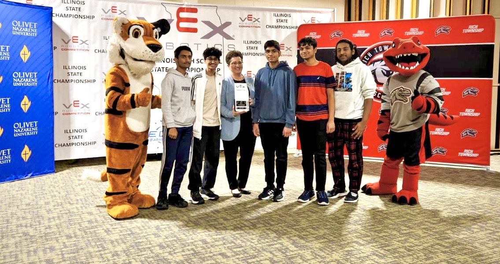
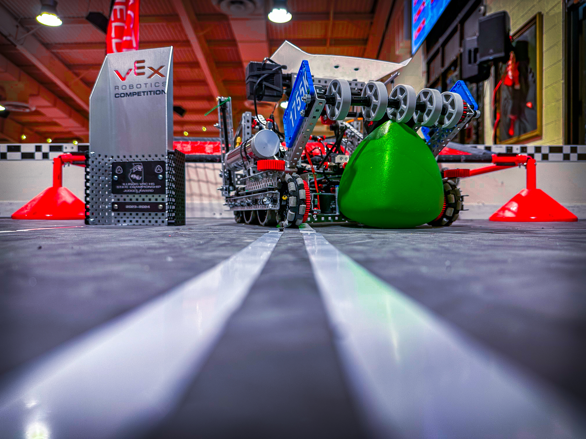

# Robotics Code for Team 1755K




Welcome to the official repository for Team 1755K's robotics projects! Here, you’ll find all the code, documentation, and resources for our team's journey, including past competition archives and the latest innovations. Special Thanks to our sponsor, **Polymaker**!


---

## Repository Structure

```
├── archive/                # Code and resources from competition 1, VEXcode Pro V5
│   ├── HS_competition_1/   # Aggressive and Passive Autons
│   ├── OU_season/          # Code from the previous season 
├── current/                # Ongoing and active code
│   ├── EZ-Code/            # Tournament Champions with this and improvements coming to Autons 
│   ├── LemLib-Code/        # LemLib Odometry Code Plan
├── README.md               # This file!
```

---

## Getting Started

### Cloning the Repository
To clone this repository locally, run the following command:
```bash
git clone https://github.com/yyardi/1755K-Code-24-25.git
```

### Requirements
- [Programming Environment/IDE] (VSCode, PROS by Purdue SigBots)
- [Robot Control SDK/Tool] (EZ-Template, LemLib + JerryIO)

---

## Contributing
We’re always striving to improve. Team members can:
1. Create a new branch for your updates.
2. Submit a pull request with clear descriptions.

---

## Achievements in 2024-25 High Stakes Season
🏆 **Tournament Champions at Great Lakes 2 Competition (IL States Qualifying)** <br />
🧑‍💻 **Think Award at Great Lakes 2 Competition** <br />
...More to come from GL 3, Skills, and States! 

## Achievements in 2023-24 Over Under Season
🏗️ **Ranked First in the Great Lakes 4 Competition + Build Award** <br />
💯 **200 Skills Score qualifying for the Illinois State Championship** <br />
👩‍⚖️ **Judges Award at the State Championship**


---

## Contact
For questions, suggestions, or collaboration, contact us at:
- **Email:** 1755kineticrobotics@gmail.com

